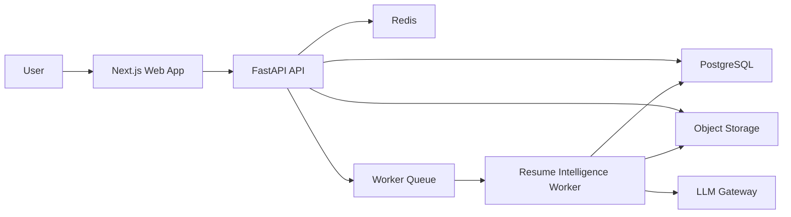

# Architecture

## High-Level System

## Services

- `apps/web`: Product UI, upload flow, comparison view, scorecard, export actions.
- `services/api`: REST API, orchestration, persistence boundary, validation.
- `services/api/app/services`: Resume parsing, JD parsing, scoring, tailoring, rendering orchestration.
- `services/api/app/ai`: Provider abstraction, structured output parsing, retry policy.
- `packages/schemas`: JSON Schema contracts shared by API, worker, and frontend.

## Key Design Decisions

- Python backend for document processing, NLP, and PDF/DOCX tooling.
- Structured resume JSON is the canonical internal representation.
- Source claims are first-class entities and are required for generated bullets.
- Tailoring is a deterministic-plus-LLM pipeline, not a single prompt.
- Scoring and validation happen outside the LLM.
- PDF/DOCX generation consumes tailored JSON, not raw LLM prose.

## Truthfulness Guardrails

1. Extract atomic source claims with source spans.
2. Normalize claims and skills.
3. Allow rewriting only from approved claim IDs.
4. Validate all rewritten bullets against claim IDs.
5. Reject bullets containing unsupported entities, dates, numbers, or skills.
6. Store explainability metadata for every change.

## Observability

- Request IDs across API and workers.
- Structured logs for parsing, scoring, AI calls, validation failures, and exports.
- Cost and latency tracking per AI run.
- Audit events for uploads, generations, exports, and edits.

## Security

- Signed file uploads and downloads.
- File type and size validation.
- Malware scanning integration point.
- PII-safe logging.
- Encryption at rest.
- Tenant isolation by `user_id`.
- Short-lived generated artifact URLs.

