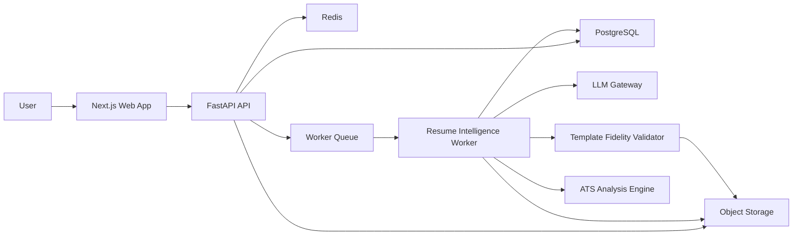

# Architecture

## High-Level System

## Services

- `apps/web`: Product UI, upload flow, comparison view, scorecard, export actions.
- `services/api`: REST API, orchestration, persistence boundary, validation.
- `services/api/app/services`: Resume parsing, JD parsing, scoring, tailoring, rendering orchestration.
- `services/api/app/services/template_analyzer.py`: Extracts PDF page, text box, font, color, and position snapshots.
- `services/api/app/services/template_fidelity.py`: Scores generated PDFs against the source template.
- `services/api/app/services/template_preserving_renderer.py`: Performs text-only PDF replacement and blocks low-fidelity output.
- `services/api/app/services/ats_analysis.py`: Produces keyword, skill, experience, leadership, domain, compatibility, and improvement analysis.
- `services/api/app/services/ats_report_renderer.py`: Produces the downloadable ATS report artifact.
- `services/api/app/ai`: Provider abstraction, structured output parsing, retry policy.
- `packages/schemas`: JSON Schema contracts shared by API, worker, and frontend.

## Key Design Decisions

- Python backend for document processing, NLP, and PDF/DOCX tooling.
- Structured resume JSON is the canonical internal representation.
- Source claims are first-class entities and are required for generated bullets.
- Tailoring is a deterministic-plus-LLM pipeline, not a single prompt.
- Scoring and validation happen outside the LLM.
- Production PDF generation uses the source PDF as the master template and changes only approved text regions.
- Generic HTML-to-PDF rendering is only acceptable for internal preview/debug output, not production resume export.
- Template fidelity must be at least 99% before output is returned.

## Truthfulness Guardrails

1. Extract atomic source claims with source spans.
2. Normalize claims and skills.
3. Allow rewriting only from approved claim IDs.
4. Validate all rewritten bullets against claim IDs.
5. Reject bullets containing unsupported entities, dates, numbers, or skills.
6. Store explainability metadata for every change.

## Template Preservation Guardrails

1. Extract a `TemplateSnapshot` from the source PDF.
2. Map parsed resume claims to immutable PDF text boxes.
3. Generate text replacements only for existing text boxes.
4. Keep section order, page count, coordinates, font metadata, colors, and margins locked.
5. If replacement text overflows the original region, compress content or remove lower-relevance text.
6. Render the PDF through a text-only replacement layer.
7. Extract a second `TemplateSnapshot` from the generated PDF.
8. Compare source and generated snapshots.
9. Return output only when `overall_score >= 99`.

Template preservation has priority over page limits. The app must shorten or remove text before it changes the visual template.

## Preview And Download Flow

1. Tailoring run creates tailored JSON, ATS analysis, and change summary.
2. Export worker applies text-only replacements to the source PDF.
3. Fidelity validator blocks output below 99%.
4. Object storage receives original PDF, tailored PDF, and ATS report PDF.
5. API returns signed URLs and page counts.
6. Web app renders original/tailored PDF previews, zoom controls, side-by-side comparison, downloads, and version history.

## Observability

- Request IDs across API and workers.
- Structured logs for parsing, scoring, AI calls, validation failures, and exports.
- Cost and latency tracking per AI run.
- Audit events for uploads, generations, exports, and edits.

## Security

- Signed file uploads and downloads.
- File type and size validation.
- Malware scanning integration point.
- PII-safe logging.
- Encryption at rest.
- Tenant isolation by `user_id`.
- Short-lived generated artifact URLs.
